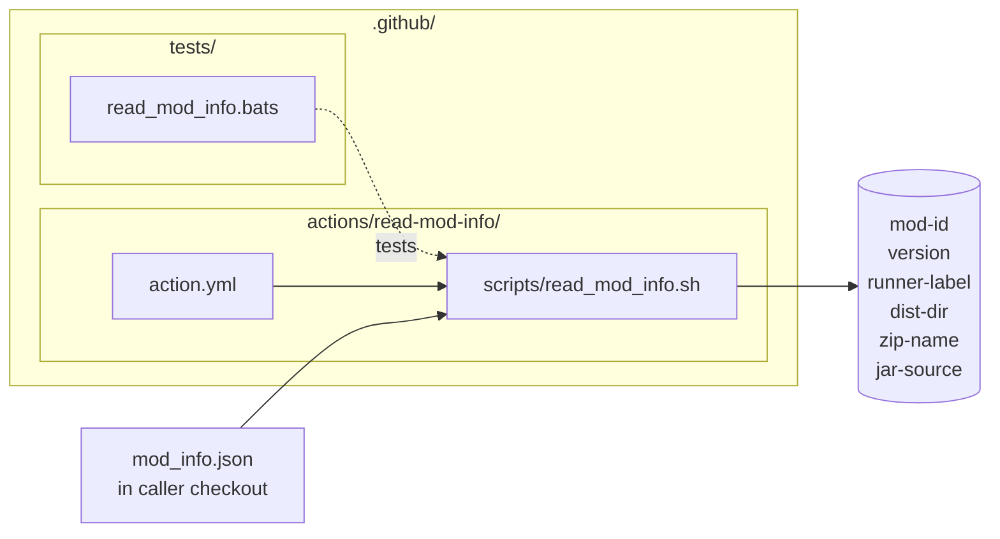
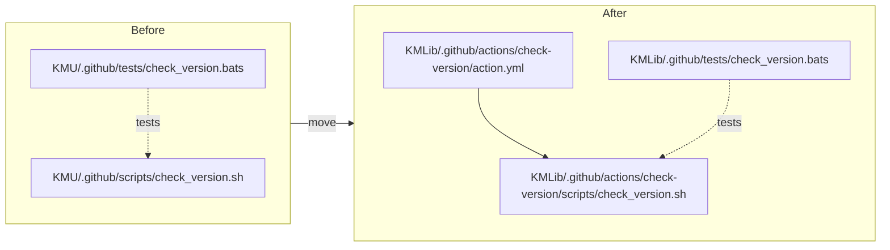
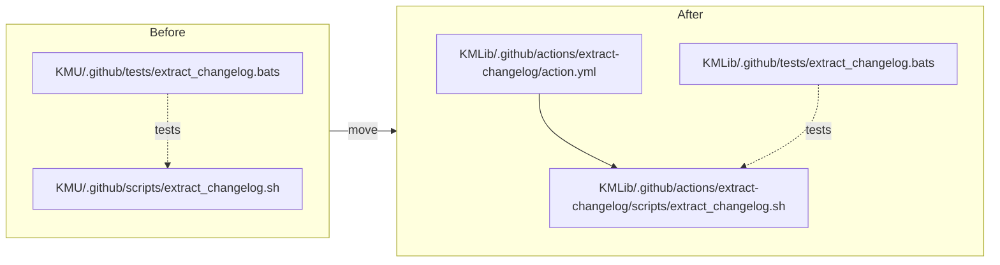
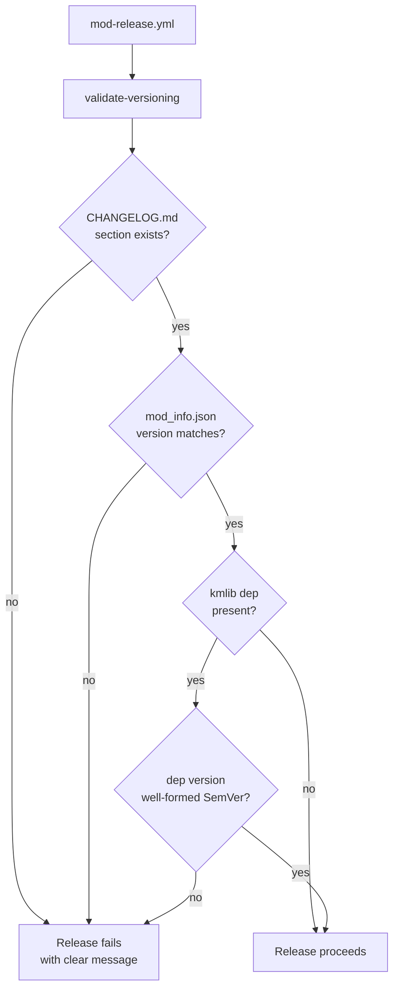
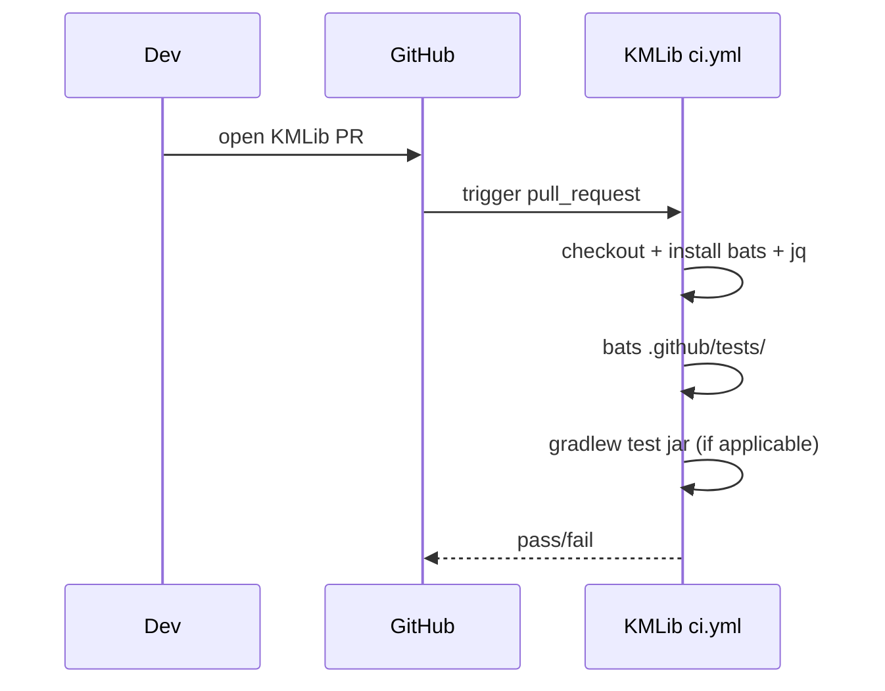
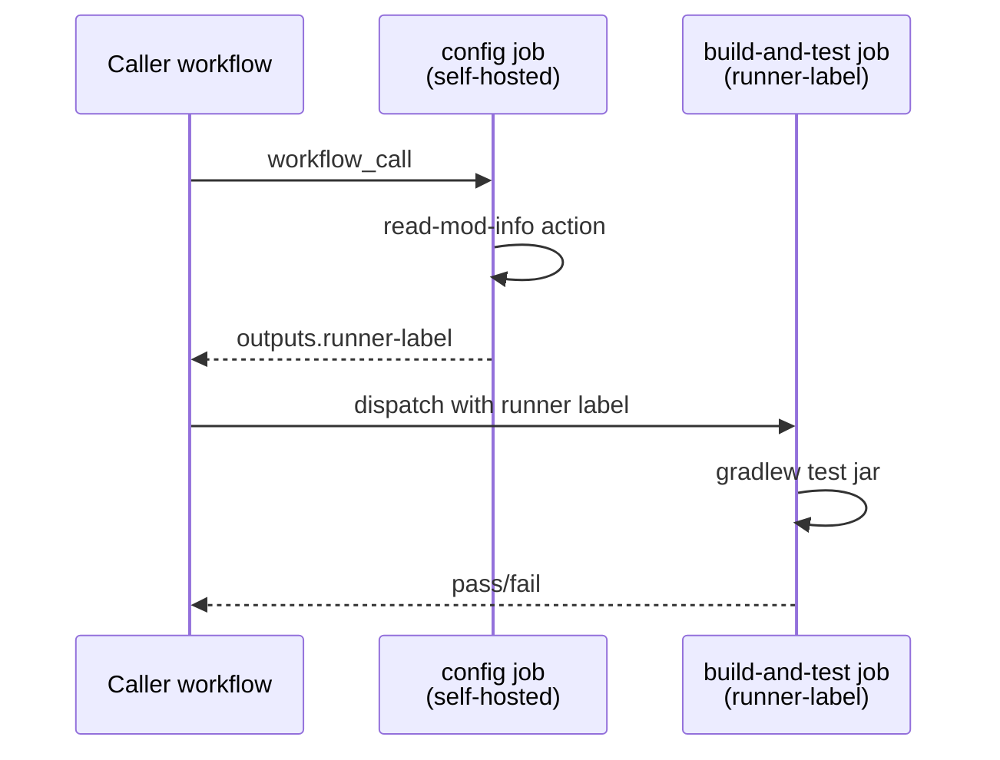
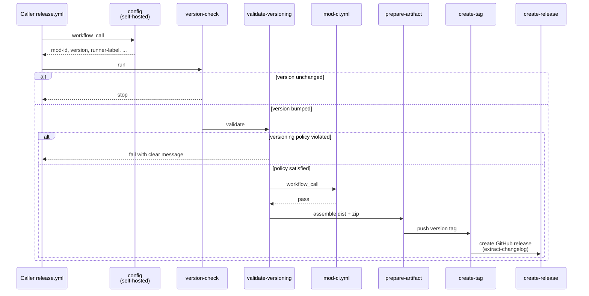
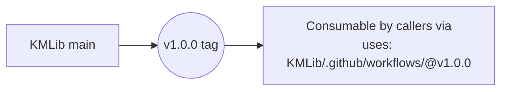
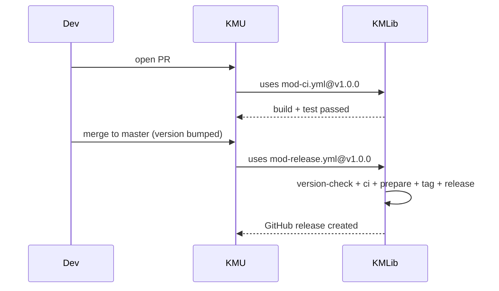

# Plan: Extract KMU CI/release into KMLib reusable workflows

See [problem.md](problem.md) for context, goal, and the
[derivation convention](problem.md#convention-derived-from-modinfojson).

## Index

- [Step 1 - Bootstrap KMLib `.github/` layout and config composite action](#step-1---bootstrap-kmlib-github-layout-and-config-composite-action)
- [Step 2 - Move `check_version` script and tests into KMLib as a composite action](#step-2---move-check_version-script-and-tests-into-kmlib-as-a-composite-action)
- [Step 3 - Move `extract_changelog` script and tests into KMLib as a composite action](#step-3---move-extract_changelog-script-and-tests-into-kmlib-as-a-composite-action)
- [Step 4 - Add `validate-versioning` composite action](#step-4---add-validate-versioning-composite-action)
- [Step 5 - Add KMLib's own CI workflow that runs the bats tests](#step-5---add-kmlibs-own-ci-workflow-that-runs-the-bats-tests)
- [Step 6 - Add reusable `mod-ci.yml` workflow](#step-6---add-reusable-mod-ciyml-workflow)
- [Step 7 - Add reusable `mod-release.yml` workflow](#step-7---add-reusable-mod-releaseyml-workflow)
- [Step 8 - Tag KMLib v1.0.0](#step-8---tag-kmlib-v100)
- [Step 9 - Migrate KMU to consume KMLib reusable workflows](#step-9---migrate-kmu-to-consume-kmlib-reusable-workflows)

## Conventions

- Each step is committable on its own and is gated on the user's review.
- Every step lists its tests. Steps that only restructure files are tested by
  KMLib CI (Step 5 onward) and, for Step 9, by an end-to-end KMU dry run.
- ASCII only. No long dashes. No literals where a named constant fits.
- Cross-references use links; nothing duplicated between problem and plan.

---

## Step 1 - Bootstrap KMLib `.github/` layout and config composite action

**Reason:** Every later step depends on a shared place to read `mod_info.json`
and emit the derived values listed in
[Convention](problem.md#convention-derived-from-modinfojson). Putting this in a
composite action means the same derivation is reused by both `mod-ci.yml` and
`mod-release.yml` without duplication.

**Changes:**

- create `mods/KMLib/.github/actions/read-mod-info/action.yml`:
  - composite action;
  - reads `mod_info.json` from the caller checkout's working directory;
  - emits outputs: `mod-id` (`.id` verbatim), `version`, `runner-label`,
    `dist-dir`, `zip-name`, `jar-source`. See
    [problem.md derivation table](problem.md#convention-derived-from-modinfojson).
- create empty `.github/workflows/` and `.github/tests/` directories with
  `.gitkeep` so later steps land cleanly.

**Tests:**

- bats test under `.github/tests/read_mod_info.bats` that drives the action's
  script in isolation against a fixture `mod_info.json` and asserts each output
  value. Composite actions are not unit-testable directly, so the action calls
  a thin `scripts/read_mod_info.sh` and the bats test targets that script.
- the test is wired up in [Step 5](#step-5---add-kmlibs-own-ci-workflow-that-runs-the-bats-tests).

---

## Step 2 - Move `check_version` script and tests into KMLib as a composite action

**Reason:** The version-comparison logic is the gate that decides whether the
release pipeline runs. It is generic across mods and already has bats coverage
in KMU - moving it whole preserves the safety net.

**Changes:**

- move `mods/KMU/.github/scripts/check_version.sh` to
  `mods/KMLib/.github/actions/check-version/scripts/check_version.sh`
  (no logic change beyond reading `mod_info.json` from the action's working
  directory, which is already the caller's checkout);
- create `mods/KMLib/.github/actions/check-version/action.yml`:
  - composite action;
  - inputs: none;
  - outputs: `version`, `version-updated`;
  - delegates to the script above.
- move `mods/KMU/.github/tests/check_version.bats` to
  `mods/KMLib/.github/tests/check_version.bats`.
- delete the originals from KMU in this step's commit so KMLib becomes the
  single source of truth. KMU's `release.yml` keeps working only until
  [Step 9](#step-9---migrate-kmu-to-consume-kmlib-reusable-workflows) runs - this
  is acceptable because Step 9 is a small, immediately-following step and no
  KMU release should occur in between. If a release is needed urgently, do
  Steps 2-9 in one sitting.

**Tests:**

- the bats test moves with the script; it will run in KMLib CI from Step 5.
- manual verification: run `bats .github/tests/check_version.bats` locally
  inside `mods/KMLib`.

---

## Step 3 - Move `extract_changelog` script and tests into KMLib as a composite action

**Reason:** Same rationale as [Step 2](#step-2---move-check_version-script-and-tests-into-kmlib-as-a-composite-action)
for the changelog extractor. Bundled as its own action because `mod-release.yml`
only needs it in the final stage, and a future workflow may want it standalone.

**Changes:**

- move `mods/KMU/.github/scripts/extract_changelog.sh` to
  `mods/KMLib/.github/actions/extract-changelog/scripts/extract_changelog.sh`.
- create `mods/KMLib/.github/actions/extract-changelog/action.yml`:
  - composite action;
  - inputs: `version` (required);
  - outputs: `notes-file` (path to the generated `release-notes.md`);
  - delegates to the script above.
- move `mods/KMU/.github/tests/extract_changelog.bats` to
  `mods/KMLib/.github/tests/extract_changelog.bats`.
- delete the originals from KMU.

**Tests:**

- bats test moves with the script and runs in KMLib CI from Step 5.

---

## Step 4 - Add `validate-versioning` composite action

**Reason:** [versioning.md](../../versioning.md) defines the policy but
documentation alone does not enforce it. A composite action wired into
`mod-release.yml` makes a consumer's release fail when it drifts from the
policy: missing changelog section, mismatched `mod_info.json` version, or
malformed KMLib dependency pin. Catching drift at release time avoids
silent disagreement between docs and shipped artifacts.

**Changes:**

- create `mods/KMLib/.github/actions/validate-versioning/action.yml`:
  - composite action;
  - inputs: `version` (required - the version about to be released, supplied
    by `mod-release.yml` from the `read-mod-info` output);
  - delegates to the script below so the logic is bats-testable.
- create `mods/KMLib/.github/actions/validate-versioning/scripts/validate_versioning.sh`:
  - fails (non-zero exit + clear message) if `CHANGELOG.md` does not exist
    or has no section heading matching `## [<version>]` (date suffix
    permitted, not required);
  - fails if `mod_info.json` `.version` does not equal the input `version`,
    so a stale or hand-edited tag cannot release a version different from
    what the file declares;
  - if `mod_info.json` lists a `kmlib` dependency, fails when that
    dependency's `version` field is missing or not well-formed SemVer
    (`MAJOR.MINOR.PATCH`);
  - the kmlib-dependency check is gated on the dependency being present
    rather than being required, so KMLib's own release uses the same action
    without needing a self-dependency.
- create `mods/KMLib/.github/tests/validate_versioning.bats`:
  - fixture-driven coverage of each branch: changelog present passes,
    changelog absent fails, changelog without matching section fails,
    `mod_info.json` version mismatch fails, well-formed kmlib dep passes,
    malformed kmlib dep fails, absent kmlib dep is allowed.

**Tests:**

- the bats file above; runs in KMLib's own CI added in
  [Step 5](#step-5---add-kmlibs-own-ci-workflow-that-runs-the-bats-tests).
- end-to-end: KMU's first KMLib-backed release in
  [Step 9](#step-9---migrate-kmu-to-consume-kmlib-reusable-workflows) must
  fail if KMU's `CHANGELOG.md` is missing the released version's section.
  Confirm by intentionally omitting the section in a throwaway branch.

---

## Step 5 - Add KMLib's own CI workflow that runs the bats tests

**Reason:** Now that scripts and their tests live in KMLib, KMLib needs its own
CI to keep them green. Without this, the moves in Steps 1-3 lose their safety
net the moment KMU stops running the tests.

**Changes:**

- add `mods/KMLib/.github/workflows/ci.yml`:
  - triggers: `pull_request`, `workflow_call`;
  - runs on a GitHub-hosted `ubuntu-latest` runner (KMLib's CI does not need
    Starsector binaries; bats only needs Linux and `jq`);
  - steps: checkout, install bats, install jq, run `bats .github/tests/`;
  - also runs `./gradlew test jar` if KMLib has a Gradle build that needs
    gating (verified before writing the step).

**Tests:**

- the workflow itself is the test runner; verified by opening a PR in KMLib
  and confirming the bats job passes.

---

## Step 6 - Add reusable `mod-ci.yml` workflow

**Reason:** This is the workflow consumer mods will call from their PR gate. It
mirrors KMU's current `ci.yml` but derives every mod-specific value via the
`read-mod-info` action from [Step 1](#step-1---bootstrap-kmlib-github-layout-and-config-composite-action).

**Changes:**

- add `mods/KMLib/.github/workflows/mod-ci.yml`:
  - trigger: `workflow_call`;
  - no inputs;
  - job `config` runs on `runs-on: self-hosted`, calls `read-mod-info`, emits
    `runner-label` as an output;
  - job `build-and-test` `needs: config`, `runs-on: ${{ needs.config.outputs.runner-label }}`;
    - checkout, set up Java 17 (temurin), `chmod +x gradlew`,
      `./gradlew test jar`;
    - relies on `STARSECTOR_HOME` set on the runner VM exactly as today.

**Tests:**

- KMLib does not consume `mod-ci.yml` itself (KMLib has no Starsector runtime).
  End-to-end verification happens in
  [Step 9](#step-9---migrate-kmu-to-consume-kmlib-reusable-workflows) when KMU
  opens a PR.

---

## Step 7 - Add reusable `mod-release.yml` workflow

**Reason:** Same shape as KMU's current `release.yml`, but mod-specific values
(`mod-id`, `version`, `runner-label`, `dist-dir`, `zip-name`, `jar-source`)
come from `read-mod-info`. The version-check, validate-versioning, and
changelog-extract steps use the composite actions added in Steps 2, 3, and 4.

**Changes:**

- add `mods/KMLib/.github/workflows/mod-release.yml`:
  - trigger: `workflow_call` only (callers wire their own `push: master`);
  - permissions: `contents: write`;
  - jobs in order: `config` (self-hosted, runs `read-mod-info`),
    `version-check` (uses `check-version` action; needs `config`),
    `validate-versioning` (uses `validate-versioning` action with
    `version: ${{ needs.config.outputs.version }}`; runs only when
    `version-updated == true` so unchanged-version pushes are not gated;
    blocks all downstream jobs on failure),
    `ci` (calls `mod-ci.yml` via `uses:` if `version-updated == true` and
    `validate-versioning` passed),
    `prepare-artifact` (assembles `dist/<mod-id>/` and zips it),
    `create-tag`, `create-release` (uses `extract-changelog` action).
  - all worker jobs run on `${{ needs.config.outputs.runner-label }}`.

**Tests:**

- end-to-end verification via KMU dry run in
  [Step 9](#step-9---migrate-kmu-to-consume-kmlib-reusable-workflows). The
  dry run must include a "missing changelog section" case that confirms
  `validate-versioning` blocks the release.

---

## Step 8 - Tag KMLib v1.0.0

**Reason:** Consumer mods pin by git tag (per
[problem.md#goal](problem.md#goal)). Until KMLib has a tag, KMU cannot pin a
stable reference and would have to track `main`, which contradicts the chosen
pinning strategy.

**Changes:**

- bump `mod_info.json` version in KMLib if needed for parity with the tag;
- update KMLib `CHANGELOG.md` with an entry describing the new reusable
  workflows and composite actions;
- create annotated git tag `v1.0.0` on KMLib's main branch;
- push the tag.

**Tests:**

- verify the tag exists on the remote;
- verify `mods/KMLib/.github/workflows/mod-release.yml@v1.0.0` resolves when
  referenced from a scratch workflow.

---

## Step 9 - Migrate KMU to consume KMLib reusable workflows

**Reason:** This is the payoff: KMU drops the duplicated workflow bodies and
scripts and becomes a thin caller. Until this step lands, KMU is in a broken
state (its scripts were deleted in Steps 2-3) - so Step 9 must follow Steps 2-3
without delay.

**Changes:**

- rewrite `mods/KMU/.github/workflows/ci.yml`:
  - trigger: `pull_request`, `workflow_call`;
  - single job that `uses: <owner>/KMLib/.github/workflows/mod-ci.yml@v1.0.0`.
- rewrite `mods/KMU/.github/workflows/release.yml`:
  - trigger: `push: master`;
  - single job that `uses: <owner>/KMLib/.github/workflows/mod-release.yml@v1.0.0`.
- delete `mods/KMU/.github/scripts/` and `mods/KMU/.github/tests/`
  (already moved to KMLib in Steps 2-3).
- update `mods/KMU/mod_info.json` to add a `version` field to the `kmlib`
  dependency entry (`"version": "1.0.0"`) so the
  [validate-versioning action](#step-4---add-validate-versioning-composite-action)
  passes. Per
  [versioning.md](../../versioning.md#pinning-kmlib-from-a-consumer), this
  pin must move in lock-step with the workflow-pin tag on the same commit.
- confirm `mods/KMU/CHANGELOG.md` has a section heading for the current KMU
  version. Add it if missing - validate-versioning will fail the next release
  otherwise.
- update [mods/KMU/docs/dev/release.md](../../../../KMU/docs/dev/release.md) to
  point at KMLib for workflow internals; keep mod-local runner setup
  (`kmu-runner` label, `STARSECTOR_HOME`) as KMU's responsibility.
- amend KMU's
  [Step 8 of its plan](../../../../KMU/docs/dev/implementation/001-add-planetary-condition/plan.md#L389)
  with a short note that the workflow files were extracted to KMLib and that
  KMU now consumes them via `workflow_call`. Do not rewrite the historical
  step; append a "Migrated to KMLib" subsection.

**Tests:**

- open a no-op PR in KMU and confirm `ci.yml` passes via the KMLib reusable
  workflow;
- merge a master commit with no version change and confirm `release.yml`
  stops at `version-check`;
- merge a master commit with a version bump and confirm the full pipeline
  produces a GitHub release with the correct zip name and changelog notes;
- on a throwaway branch, bump the version but omit the new
  [`CHANGELOG.md`](../../../../KMU/CHANGELOG.md) section, push, and confirm
  the release fails inside `validate-versioning` with a clear message.

