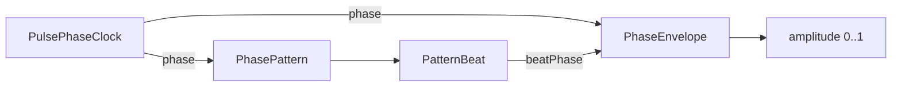

# KMLib Animation

Part of [KMLib](../../../../../README.md).

Arithmetic over time and nothing else -
no colour,
no shape,
no element,
no pointer.
Whatever holds one of these decides for itself what its number drives,
which is what lets one fraction serve every animation on a surface
where a shared effect would have to know what each of them is made of.
Nothing here names the Starsector API,
and nothing here is persisted:
every type is only where an animation currently sits,
so none of them needs migrating.

## Index

- [Two families: stepped and read](#two-families-stepped-and-read)
- [The register](#the-register)
- [The two envelopes](#the-two-envelopes)
- [Composing a read](#composing-a-read)
- [Beat units and the two rhythms](#beat-units-and-the-two-rhythms)
- [Why a phase comes off real time](#why-a-phase-comes-off-real-time)
- [Spreading like emitters apart](#spreading-like-emitters-apart)

## Two families: stepped and read

The one distinction that decides which type to reach for.

**Stepped** types hold where they currently stand and must be advanced by each frame's elapsed time.
They answer an *event* -
a key struck,
a value confirmed,
a pointer held down -
and their time is measured from the moment that event happened,
which nothing but the caller knows.
Forgetting the advance freezes them part-way.

**Read** types hold nothing.
The value is a function of the instant it is asked at.
They answer a *cycle that was already turning*,
so there is no per-frame call to place and none to forget,
two consumers drawing in different passes of one frame agree
because they evaluate the same function of the same clock,
and a surface that stops drawing comes back to a cycle that kept running
rather than to one that starts when it is looked at.

The choosing rule is whether something *happened* or something *is going on*.
A lift owed to a moment the caller can name is stepped;
ambient repetition nobody triggered is read.

## The register

| Type | Family | Answers |
| --- | --- | --- |
| `EasedFraction` | stepped | how far between two ends something is, advanced toward a target and eased only on read |
| `TraverseDurations` | - | how long a motion takes each way, as a pair |
| `PulseEnvelope` | stepped | a lift a trigger sends out and back, or holds at its peak until released |
| `PulseEnvelopes<K>` | stepped | the same, one per element of a keyed set, advanced in one pass |
| `PulsePhaseClock` | read | where a repeating animation stands in its cycle at the instant it is asked |
| `PhaseEnvelope` | read | how high a value stands at a point in one turn of a cycle |
| `PhasePattern` | read | which stretches of a turn sound and which stay silent |
| `PatternBeat` | - | the element of a pattern a phase is in, and how far through it |

`TraverseDurations` sits outside the split because it paces the stepped types
rather than holding anything:
a rise and a fall are separate values
because a motion answering input does not read right when they are equal -
a rise confirms what the player just did and wants to arrive,
while a fall is the element letting go and can take its time.

Easing is not this package's.
Both `EasedFraction` and `PhaseEnvelope` ease on read through `kmlib.math.easing.Easing`,
so the curve is one shape to reason about rather than arithmetic threaded through each of them.

## The two envelopes

`PulseEnvelope` and `PhaseEnvelope` are not alternatives,
and the shared word is the whole reason this section exists.

- **`PulseEnvelope`** is a lift something *triggers*.
  It times its own rise and fall from that moment,
  holds where it stands,
  and has to be stepped every frame.
  Retriggering aims it back at the peak from wherever it is rather than replaying from zero,
  so a repeated trigger neither stacks past the peak nor dips first.
  A held trigger waits at the top until released,
  for an act the player is still making.
- **`PhaseEnvelope`** is a *shape read off a phase*:
  climbing over a leading share of the turn and falling over the rest of it.
  It holds nothing and steps nothing.
  The share carries what the animation reads as -
  most of the turn spent climbing swells,
  a sliver of it strikes and decays,
  which is what an alarm or a ping looks like.

Both ends of a `PhaseEnvelope`'s turn sit at rest,
so a phase that wraps carries the amplitude round with it and nothing jumps at the seam.
A share of 0 stands at the peak from the turn's first instant and decays across the whole of it;
a share of 1 climbs across the whole of it and never falls.

## Composing a read

The read side composes into one amplitude,
either straight through an envelope for a plain repeating swell,
or through a rhythm first for one that stops and starts.

`PatternBeat` carries both whether the element sounds and how far through it the phase stands,
because either alone gets a consumer the wrong picture:
a progress without the state cannot tell the opening instant of a sound from a silence -
and with an instant rise those two read identically -
while a state without the progress cannot shape the sound it just reported.

## Beat units and the two rhythms

A pattern's lengths are held in beat units rather than seconds,
so how fast it runs is the consumer's decision and how it is proportioned is the pattern's.
One unit is the rhythm's shortest sound;
every other length is a multiple of it,
which is what keeps a rhythm recognisable at any pace.
`resolvePeriodSeconds` converts a pace into the period to drive the clock at,
so no caller derives one from a length it would have to know.

| Rhythm | Proportions | Turn |
| --- | --- | --- |
| `STEADY_BEAT` | one sound, one silence as long as it | 2 units |
| `SOS` | three short, three long, three short; sounds parted by one, the group by seven | 30 units |

Elements alternate strictly,
opening on a sound and closing on a silence.
That is what lets a phase at the very end of a turn read as the opening instant of the next one,
so a wrapping phase crosses the seam without repeating or skipping an element -
and it is why the rhythms are a closed set rather than something a caller composes.

## Why a phase comes off real time

`PulsePhaseClock` reads a monotonic source rather than simulation time,
because the two disagree exactly where an ambient animation has to carry on regardless.
A paused simulation stops advancing at all and a compressed one advances many seconds per frame,
so an animation phased off it would freeze in the first case and strobe in the second -
neither of which is anything the player did to the thing being animated.

Elapsed time is measured from the moment the clock was made,
so only differences are ever read
and a wall clock stepping backwards cannot send a phase back around.
A fresh clock starts its cycles over,
which is invisible in animation that repeats anyway.

## Spreading like emitters apart

Like things timed off one clock all peak on the same frame,
which reads as one thing happening rather than as many sources.
`resolvePhaseForSubject` moves each subject along its own fixed share of the turn,
derived from the subject's name through `kmlib.math.hashing.StableFractions`
rather than drawn or stored -
so a subject sits at the same point in every session and nothing has to be persisted for it to.
